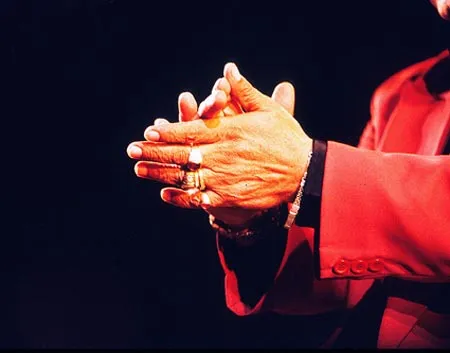



## Su cosa si basa il flamenco, questo sconosciuto...?

di 

### Introduzione

Far luce sul fenomeno è un vero e proprio lavoro che può durare anni e anni. Da soli, la  passione e l'impegno non bastano: occorrono possibilità di viaggiare, denaro, conoscenza di lingue straniere, tempo... Avere quattro informazioni di base su che cosa sia, è però fondamentale per aiutarci a capirlo e perciò a ballarlo.

Questo piccolo saggio si guarda bene dal credersi esaustivo, ma è stato scritto con l'intento assoluto di far capire i fatti e non di fornire delle vuote informazioni teoriche.

`Capitolo 1`

### 1 - Che cos'è il Flamenco?



Si tratta di una forma d'arte molto complessa e forse proprio per questo così profondamente affascinante. Esprime con grande lirismo tutte le emozioni dell'animo umano, dalla gioia alla rabbia, al dolore, alla voglia di vivere, al gioco, alla passionalità, alla solitudine, all'ira, alla rivolta... sempre con la forza dell'autoaffermazione, dell'essere totalmente presenti, del vivere tutto ciò che la vita offre senza negazioni, con grande coraggio e positività.

Anche di fronte al dolore più profondo, il Flamenco non è mai disperato.

Il flamenco esprime la sua emozione, non vi si identifica. Mantiene sempre ben salda la propria identità di essere umano, e l'emozione narrata non è mai quella personale del momento ma sempre quella della collettività, dell'umanità in generale.

Il Flamenco parla di archetipi.
La tradizione andalusa può sembrare molto lontana dalla nostra, e probabilmente lo è, ma ci può comunque insegnare un modo di leggere anche il nostro presente.

Nel Flamenco la bellezza estetica è per tradizione molto marginale, anche se negli ultimi anni la ricerca stilistica musicale e nel campo del movimento ha generato la creazione di coreografie e brani musicali molto sofisticati anche dal punto di vista estetico. La cosa importante resta comunque il sentire e l'esprimere l'emozione senza veli, senza timori, senza mediazioni.

In tal senso l'apporto del pubblico influenza fortemente il risultato della performance: se l'espressione nasce dall'emozione, il contesto presente ha un grande ruolo sullo stato d'animo dell'artista, e le risposte del pubblico possono determinare una svolta nello spettacolo.

Il pubblico del Flamenco risponde agli artisti sulla scena con esclamazioni, intere frasi di commento, urla ecc., e lo fa in misura maggiore quanto più lo spettacolo avviene in un gruppo ristretto di persone.



Spesso le _juergas_, le riunioni flamenche, si protraggono per molte ore nella notte, in modo che artisti e pubblico siano molto stanchi e che l'emozione e magari qualche buon bicchiere di vino abbiano fatto in modo che le inibizioni e le convenzioni sociali lascino il posto alla vera spontaneità. In una fiesta chiunque può intervenire, così come sente di volerlo fare, senza contenersi, senza vergogna, senza esibizionismo, ma soltanto con il bisogno di lasciar uscire qualcosa che sente dentro.

Ovviamente, però, deve conoscere i canoni su cui si costruisce il flamenco, e rispettarne codici, convenzioni e schemi di comportamento: il Flamenco è molto orgoglioso delle sue tradizioni!

Il pubblico, in tutte le situazioni, anche in quelle formali dei grandi teatri, partecipa con grida (il _Jaleo_) provocate da ciò che gli artisti fanno e a volte anche con il battito delle mani (_Palmas_), il tutto secondo un codice tradizionale.

Tradizionalmente, il cuore della zona d'origine del Flamenco viene indicato dai flamencologi nel triangolo fra Siviglia (soprattutto nel _barrio_, cioè quartiere, di Triana), Cadice (barrio di Santa Maria) e Jerez de la Frontera (barrio Santiago).

### 2 - Come ascoltare il Flamenco?



Occorre tenere presente che esistono differenze fra la musica che nasce per il _cante_, quella che nasce per il _baile_ e quella che nasce per la chitarra. Gli aspiranti _bailaores_ tengano presente che non si può danzare seguendo tutti i criteri della tradizione flamenca senza musica dal vivo. Questa regola non ammette deroghe!

Esistono in commercio cd destinati all'esercizio del _baile_, come quelli della collana diretta da **Manuel Salado** "Solo compás" o quelli della collana presentata da **Cristina Hoyos** "Escuela de Flamenco", creati su precisi codici che la tradizione ha creato per il _baile_, mentre tutti i brani in commercio, a meno che non si tratti di registrazioni dal vivo di qualche spettacolo con danza, sono costruiti su altri criteri.

È evidente che si possa, per contro, costruire una coreografia contemporanea o sperimentale anche su di un brano nato per altri scopi! I brani destinati all’ascolto hanno velocità e struttura diversa da quelli creati per la danza, e in alcuni casi, ad esempio nei brani _por Siguiriyas_, l'irregolarità del tempo che serve a sottolineare la liricità del _cante_ o della chitarra renderebbe impossibile al danzatore ballare.

Inoltre, la necessità intrinseca del _baile_ flamenco di nascere in maniera corale, con la collaborazione di tutti gli aspetti dello spettacolo- musica, _cante_ e _baile_- rende assurdo l'utilizzo, in qualunque caso, di musiche registrate per una performance, anche nel caso in cui queste fossero state registrate appositamente per il _baile_: saranno deboli rispetto alle necessità del "qui ed ora" tipiche del Flamenco.

Fondamentale per chi voglia comprendere il Flamenco è educare la propria capacità di ascolto. Noi stranieri arriviamo al Flamenco da adulti, e comunque viviamo immersi in un universo sonoro completamente diverso.

Certo si potrebbe dire, usando immagini poetiche e idealistiche, che, essendo l'Arte un valore universale, se ne possa fruire al di là della propria preparazione culturale, ma queste sono solo idee teoriche e piuttosto semplicistiche.

La realtà è che per crearsi un orecchio che capisca il Flamenco occorrerà... ascoltarlo. Molto. Meglio sempre, soprattutto se si vuole, con tutta l'umiltà ed il rispetto dovuto, tentare di partecipare al fenomeno.

### 3 - Il baile Flamenco nasce da un miscuglio fra:



- Danza classica spagnola: sono danze legate all'antica tradizione campestre e domestica o alla moderna tradizione della scuola di nacchere. Fra le altre spiccano le danze della scuola Bolera (rielaborazione artistica e teatrale dei balli popolari andalusi secondo un metodo vicino alla danza classica)

- _Baile_ "jondo" e _Baile_ "festero" che nascono da danze sacre, arabe, gitane...

- Danze miste teatrali, che fanno parte del repertorio della tradizione flamenca dal punto di vista musicale, ma che, come danze, sono nate per un palcoscenico teatrale: _Peteneras_, _Granainas_, _Tarantas_, _Zorongos_... Sono danze che nascono su generi tradizionalmente interpretati dai soli cante e chitarra.

- Oggi è sempre più chiara l'influenza nel Flamenco di altre forme di danza, soprattutto la Danza Contemporanea, la Danza Moderna ed espressioni del Teatro Danza, ma persino il Butoh, l'Hip Hop, la Danza Indiana...

Nella prospettiva sempre più multiculturale della società odierna è molto probabile che un numero sempre maggiore di stili e tecniche di danza vadano ad influenzare il Baile, come già da anni sta succedendo nel campo della musica, dai primi esperimenti di **Paco De Lucia** in poi.

`Capitolo 2`

### 1 - Il rapporto Flamenco-vita in Andalusia nel corso del tempo



Musica e danza sono ancor oggi parte della vita quotidiana in Andalusia. Sono manifestazioni forti dell'appartenenza ad una terra e ad una cultura. Nelle _ferias_, le feste popolari, la gente balla e canta per giorni, e scorrono fiumi di alcool (il vino andaluso è molto rinomato: si pensi alla fama dello Sherry, nome internazionale del cognac prodotto a Jerez de la Frontera).

Esistono in Andalusia molte forme musicali e coreutiche di tradizione popolare, che non avevano, in origine, nulla in comune con il Flamenco. Alcune di esse sono state "afflamencate", cioè rese flamenche, mentre altre hanno mantenuto una identità distinta, lasciandosi soltanto influenzare dai modi di cantare e suonare tipici del Flamenco.

Fin dal secolo XVI i Gitani sono stati i migliori interpreti delle tradizioni musicali e coreutiche della zona, tramandando l'arte nell’ambito familiare, sia a livello amatoriale che a livello professionale.

Questo fenomeno, peraltro, trova forti rispondenze anche in altre società. Fra l'altro, fare arte poteva essere per i Gitani la orgogliosa rivincita delle frustrazioni di una vita limitata dall'emarginazione e da mille problemi pratici, che andavano dalla povertà ai pregiudizi razziali.

Il Flamenco è poi uscito dal ristretto ambito familiare per diventare forma di spettacolo professionale a tutti gli effetti, ampliando così il proprio repertorio. Dapprima ogni artista flamenco, cantante, chitarrista o danzatore che fosse, aveva un repertorio del tutto centrato su un solo stile, quello tipico della sua zona d'origine, e che sentiva più affine al suo carattere.

### 2- L'Epoca dei Cafès Cantantes



Quando l'evoluzione storica portò il Flamenco nei locali di pubblico intrattenimento, i Cafés Cantantes (1859-1936), l'esigenza di offrire al pubblico uno spettacolo più vario e la necessità di vendere il prodotto della propria arte fece sì che ogni artista si cimentasse in generi diversi, creando una mescolanza fra gli stili, ma anche una loro maggiore diffusione ed un impulso alla crescita creativa, generato dalla comunicazione e dalla competitività fra artisti.

Inoltre in un locale di intrattenimento era probabile che un artista ne incontrasse altri provenienti da altre zone, appendendo così i loro canti e le loro movenze.

I cantanti dei caffè erano anche _payos_, cioè non gitani, poiché una parte del pubblico preferiva voci più raffinate ed educate, di scuola italiana, a quelle roche e graffianti dei gitani.

Vi venivano rappresentati spettacoli vari, che oltre al Flamenco comprendevano l'operetta spagnola (la _Zarzuela_), le danze classiche spagnole e le danze con le nacchere.



Alla fine dello spettacolo, si riuniva un piccolo gruppo di gitani puri che produceva il Flamenco più spontaneo, lontano dagli occhi dei curiosi.

Molti artisti dell'epoca rimasero sconosciuti perché refrattari alla pubblicità, e ligi ad una estetica fatta di sola spontaneità senza i limiti imposti dalle esigenze del palcoscenico o addirittura dalle esigenze tecniche dell'incisione musicale: i vecchi dischi a 78 giri permettevano solo di incidere 3 minuti di musica su ogni lato, è questo fatto limitava notevolmente la creatività e la spontaneità improvvisativa degli artisti.

### 3- L'Opera Flamenca

Verso la fine dell'epoca dei Cafés Cantantes, nel 1918, giunse in teatro con l'Opera Flamenca, uno spettacolo misto di vari tipi di musica, fra i quali il fandango, canzoni varie (dette _coplas_) e _pasodobles_ e i canti "di ida y vuelta", cioè i canti di "andata e ritorno", influenzati dalle culture musicali dei paesi latino americani e entrati nel repertorio Flamenco.

L'Opera Flamenca divenne sempre più teatrale, sostituendo la semplice chitarra con grandi orchestre, utilizzando scenografie e costumi ricchi e complessi.

Un tale genere di spettacolo leggero serviva a distrarre il pubblico nell'epoca dura della guerra civile e della repressione franchista.

### 4 - Il Ballet Flamenco



Verso gli anni 20 del Novecento nacque uno nuovo tipo di spettacolo teatrale, il _Ballet Flamenco_. Si tratta di un lavoro coreografico costruito sulle opere di quei compositori classici spagnoli (De Falla, Albéniz ecc.) che si erano ispirati alla musica popolare.

Vi erano però degli intermezzi flamenchi, danzati e suonati da ottimi artisti, e questo indica l'origine di forme di spettacolo che alcune compagnie teatrali di Flamenco presentano ancora in tempi ben più recenti, come quella di **Luisillo** o di **Rafaél Aguilar**. Lo spettacolo si apre con un _Ballet Flamenco_ di tipo narrativo e poi continua con una seconda parte dedicata al Flamenco puro.

### 5 - Il turismo e i Tablaos

Dopo la metà del XX secolo, il fenomeno del turismo di massa rese il Flamenco una fonte di reddito per vari operatori del settore, e si diffusero i _tablaos_, una versione riveduta e corretta dei _Cafés Cantantes_. Nei _tablaos_ si esibiscono anche ottimi artisti, e la ristrettezza dello spazio porta il pubblico a godere da vicino della loro arte, ma spesso lo spettacolo è finalizzato soltanto ad offrire ai turisti stranieri ciò che questi si aspettano di vedere, ciò che essi credono sia il Flamenco. In questo caso lo spettacolo è a volte di qualità artistica infima.



Il _tablao_ è tappa obbligatoria di ogni giro turistico organizzato, e i turisti non sono interessati a sapere che cosa sia il Flamenco: cercano solo la ballerina con le nacchere, il ventaglio, i vestiti a pois e... olé. Se lo spettacolo corrisponderà al cliché nessun cliente si lamenterà!

Calcoliamo anche che molto spesso gli artisti di un _tablao_ vengono pagati cifre irrisorie, e sono impegnati tutte le sere anche in due spettacoli, magari senza giornata libera di pausa: forse non sempre sono felici di fare il loro spettacolo per un pubblico che spesso è molto distratto (è facile vedere turisti giapponesi assopirsi durante lo spettacolo dopo aver girato tutto il giorno per monumenti sotto l'implacabile sole dell'Andalusia), e comunque a volte gli artisti che accettano un lavoro tanto mal retribuito e poco soddisfacente non hanno ancora grande esperienza o semplicemente non hanno grandi qualità artistiche.

Il fatto di essere andalusi e di fare flamenco non è garanzia assoluta di qualità.

Accanto alla degenerazione turistica ci sono invece circoli in cui il Flamenco viene conservato e diffuso: le _peñas flamencas_, nelle quali si apprezza soprattutto il _cante_.

### 6 - Il cinema e i palcoscenici teatrali internazionali



Nuovo impulso alla diffusione anche a livello internazionale del Flamenco viene offerto, a partire dagli anni 70 dalla cinematografia: i film di **Carlos Saura** con le coreografie di **Antonio Gades**, ispirati a _Bodas de Sangre_ di **García Lorca** (dal titolo "Crónica del suceso de bodas de sangre"), dalla _Carmen_ di **Mérimée** e **Bizet** ("Carmen story") e da _El Amor Brujo_ di **De Falla** ("Fuego"), e quelli successivi, "Sevillanas", "Flamenco" e "Flamenco Flamenco".

Le grandi compagnie di **Antonio Gades**, **Cristina Hoyos**, **Mario Maya** hanno portato il Flamenco in una sua visione teatrale non snaturata, ma anzi di grande qualità sui palcoscenici di tutto il mondo.

Il Flamenco viene pian piano istituzionalizzato, con la nascita di una cattedra universitaria di flamencologia, la creazione di conservatori, e la creazione di festival, conferenze, concorsi. L'editoria produce parecchi saggi e riviste.

L'evoluzione di quest'arte viva è continua, tanto che vengono ogni giorno create nuove mode, nuove tendenze musicali, nuovi modi di interpretare il canto, nuovi accenti, nuovi gesti...

Molte sono le compagnie create da artisti che ricercano nuove possibilità espressive: dal genio ritmico e dinamico di **Antonio Canales**, alla potente fluidità drammatica di **Eva la Yerbabuena**, allo sperimentalismo ai confini della danza contemporanea di **Belén Maya** e di **Rafaela Carrasco** o di **Manuel Liñan**, e oltre i confini del teatro danza di **Israél Galván** o di **Rocío Molina**, ecc.

Certamente sono da menzionare anche fenomeni di diffusione di massa del Flamenco più commerciale, come il grande successo ottenuto da **Joaquín Cortés** o la più modesta fama di **Antonio Marquez** o di **José Greco**, i quali hanno raggiunto la notorietà puntando più alla creazione di un personaggio interessante per le cronache mondane che alla qualità flamenca della loro arte. Comunque il grosso pregio di questi artisti sta nel fatto di aver reso il flamenco più accessibile agli stranieri, più comprensibile, aprendo loro la porta di un'arte complessa e a una prima analisi inafferrabile.

### 7 - Il Flamenco nascosto

  

  

    Il vero flamenco!
  



Ancora oggi moltissimi sono i musicisti di livello altissimo che non hanno mai inciso un disco o che forse ne hanno inciso uno o due soltanto, come nel caso di chitarristi come **Diego del Gastor** o di **Paco Cepero**, nella storia del flamenco, o di **Manuel Silveria** o **Gabriel Exposito** ai giorni nostri. Anche per questo è quindi importante sapere che la pur ampia offerta discografica è lontana dall'offrire un panorama totale sul mondo del Flamenco reale.

Le serate di riunione o _Juergas flamencas_ erano e sono ancora i luoghi in cui per tradizione il Flamenco alimenta se stesso e si evolve, anche se oggi l'evoluzione avviene parecchio soprattutto nelle sale prove, nelle sale registrazione, nei teatri.

### 8 - Il Flamenco e i paesi stranieri

Il Flamenco, ad un certo punto della sua evoluzione, ha incontrato un pubblico che ignorava completamente le condizioni di vita che l'avevano generato e che fino ad allora costituivano la necessità della sua esistenza.



Questo, di per sé, è un fatto, che potrebbe anche non avere conseguenze, ma si sa che ogni espressione avulsa dal contesto culturale, storico e geografico che l'ha generata può anche facilmente degenerare.

Certamente nel corso della storia molti sono stati gli artisti che hanno lavorato allo scopo di mantenere viva e reale la tradizione, ma ciononostante la tendenza a sacrificare la qualità originale, pur di farne un'attrattiva per turisti o uno strumento di notevoli guadagni è ancora vivo.

Con la danza le cose sono andate anche peggio che nel solo campo musicale: gli stranieri non hanno capito il _cante_, che è forma di difficile comprensione per un orecchio inesperto, ma si sono tuffati sul _baile_. I giornalisti delle varie testate europee ed americane hanno applicato ai _bailaores_ gli stessi canoni che utilizzano per i danzatori occidentali, creando confusione e falsi miti.

Il valore originale delle radici storiche, della rivolta e della denuncia, del sarcasmo, dei giochi di parole, della poetica, dell'ironia non sono comprensibili al largo pubblico internazionale.



Il "**Ballet español"** ha creato ancora più confusione, con le sue radici ibride e miste.

Rendendo più raffinato ciò che era popolare lo ha snaturato e reso a volte persino caricaturale, applicandovi ciò che era tradizione della danza classica romantica.

Inoltre, ovunque sia arrivato uno spettacolo di **Ballet español**, il pubblico ha creduto ciecamente che quello fosse il Flamenco, alimentando dunque fraintendimenti e confusione. C'è però da dire che proprio grazie a questa forma teatrale il flamenco ha potuto arrivare al palcoscenico di tutti i paesi del mondo.

L'antico dramma da cui nacque lo _Jondo_ è stato sostituito nella mente del grande pubblico internazionale con una sorta di cartolina sbiadita, rivestita a festa con abiti che provengono da un altro mondo, diverso e con meno preoccupazioni.

Mescolando la necessità di espressione profonda tipica del Flamenco con le necessità formali dello show business si sono spesso creati spettacoli che non hanno la pulizia formale della danza classica (ma che per essere venduti devono assomigliarle) né la forza dei contenuti emozionali del Flamenco.



Addirittura, negli anni 60 all'abito flamenco femminile si sostituirono gonne corte, (vedi le cartoline "tipiche" ancor oggi in vendita nei negozi di souvenir) per adeguarsi alla moda di allora, che ponessero in mostra le gambe delle danzatrici...

Va comunque ancora una volta ricordato che a volte anche le forme più commerciali del Flamenco possono avere la funzione positiva di avvicinare a questa arte il largo pubblico, anche al largo pubblico internazionale.

Tutto sommato, il Flamenco sta moltiplicando le proprie produzioni artistiche, i festival, l'incisione di cd e video, persino l'editoria in questi ultimi anni grazie al sempre crescente mercato internazionale. Alla Bienal di Siviglia già da anni vengono fatti ufficialmente gli annunci di spegnere i telefoni cellulari e non fotografare anche in lingua giapponese: quanti sarebbero gli spettatori se improvvisamente scomparissero, se scomparissimo dal pubblico della Bienal o del Festival di Jerez tutti noi stranieri? Basta guardarsi intorno in teatro per rendersi conto che la percentuale spagnoli- stranieri in queste occasioni è di circa 1 a 3, se non ancora meno.

Molti artisti del flamenco vivono bene grazie ai festival flamenchi internazionali, che continuano a dar loro gli altissimi cachet richiesti, anche in epoca di crisi economica in madrepatria.

Anche se il Flamenco "di esportazione" - quello che le compagnie spagnole portano in tournée per il mondo - non sempre è di buona qualità, resta comunque viva in Andalusia una fortissima produzione di spettacoli di grande qualità, ed esiste una grande varietà di stili di danza e di musica, da quelli più saldamente legati alla tradizione più pura a quelli più innovativi, influenzati dal teatro di ricerca, dalla musica jazz, dalla danza contemporanea ecc.

In particolare, il filone della ricerca sia in campo musicale che ritmico che coreutico, è oggi molto fertile, regalando al Flamenco una evoluzione che - sicuramente - mai fu tanto rapida nella storia. Oggi la diffusione di mode e stili è resa ancor più rapida dalla facile accessibilità delle fonti, tra negozi di musica, internet, Spotify, YouTube, registrazioni più o meno ufficiali.

`Capitolo 3`

### 1 - Le azioni del baile



Nel Flamenco esiste un codice di comunicazione fra gli artisti sul palco che determina la successione delle varie parti del _baile_. Se non ci fosse, d'altra parte, l'improvvisazione sarebbe del tutto impossibile!

Gli artisti devono comunicare fra loro durante la performance, adeguandosi gli uni alle esigenze degli altri e in generale a quelle del gruppo.

La chitarra deve appoggiare il _cante_, sostenerlo e assecondarne tutti i melismi e le ornamentazioni. Al _cante_, anima e principe del flamenco, si deve tributare il massimo rispetto, sempre.

Se qualcuno sta danzando, tutti i musicisti dovranno seguirne i segnali, compreso il _cante_ stesso che in questo caso viene detto "_cante pa' atrás_" (indica che il _cantaor_ sta dietro al danzatore, a far parte del _cuadro_). È pertanto fondamentale che il _bailaor_ sappia "_mandar_", comandare, perché svolge la funzione di direttore d’orchestra.

Dato che, soprattutto al giorno d'oggi, la varietà di stili e di forme nel _baile_ è praticamente infinita, e si può dire davvero che ogni _bailaor_ abbia un suo stile personale, è assolutamente necessario che il _bailaor_ conosca l'estetica del baile, nelle sue forme di chiudere e definire il _compás_, di fermarsi, di produrre i suoni, di marcare il ritmo, di camminare, in modo da mantenersi nell'ambito di un linguaggio.

Soprattutto, però, deve lasciarsi andare all'espressione, senza nascondersi dietro le forme. Deve essere presente e mettersi in gioco, a prescindere dal livello delle sue capacità tecniche: ricordiamo che non esiste nel Flamenco la forma senza il contenuto. Non ci sono immagini estetiche da riprodurre, o meglio, ci sono modelli da vivere, non da fotocopiare.



Un bailaor "freddo" non è un bailaor!

Un bailaor falso, che recita emozioni che non prova, non è un bailaor.

Qualsiasi gesto può essere Flamenco, se ha in sé l'intenzione e se chi lo compie è totalmente presente dentro il corpo. Non si tratta di forme. Sia chiaro che il _baile_ Flamenco ha regole tecniche precise, che nascono dalla sua tradizione e che vanno rispettate, soprattutto perché grazie a quel modo di usare il corpo, grazie all'uso di quei muscoli, di quel tipo di movimenti e di quel modo di essere nel corpo, il _bailaor_ può compiere i gesti del baile, che altrimenti risulterebbero impossibili da eseguire.

Ad esempio, per lo _zapateo_ (il lavoro ritmico dei piedi), se il movimento della gamba sposta troppo le cosce e il bacino, non solo l'estetica del _bailaor_ sarà danneggiata, ma lo saranno anche la sua velocità e la sua precisione, visto che perderà in stabilità.



L'adattabilità e l'aderenza ai codici è fondamentale al _bailaor_ per recuperare nelle situazioni in cui i musicisti non entrino nel modo previsto, o il _cantaor_ canti una _letra_, o strofa, di forma diversa da quella concordata.

Le regole sono molto variabili e perciò ottimo sistema per imparare a ballare è ascoltare molta musica e vedere molta danza. Per cogliere _el aire_, il pathos di un _palo_ e per capire come dare luogo a suoni con sfumature interessanti è necessario ascoltarlo parecchio. A volte un suono originale viene reso banale da una interpretazione meccanica, senza sfumature. Un bravo _bailaor_, invece, sa dare sempre _matiz_, sfumatura, al _taconeo_.

Il _bailaor_ può anche lanciare ai musicisti indicazioni e richieste verbali tipo "arriba" (=in alto) o "pá lante" (=para adelante, verso avanti) per segnalare che vuole accelerare, o "vamonos" per indicare la fine del baile, o comunicare direttamente attraverso lo sguardo.

Altra forma di comunicazione nel _cuadro_ è il _Jaleo_.

Si tratta di una tradizione complessa, di una vera arte: quella di commentare con frasi, incitazioni, commenti, la performance. Sono frasi di apprezzamento, tipo "eso es", "è questo", che sostengono l'energia del gruppo.

Anche il pubblico che conosce i codici del Flamenco interviene nel _Jaleo_, manifestando sonoramente il proprio gradimento nei confronti dello spettacolo in generale, o di un artista o di un momento in particolare. Questo fatto ci indica chiaramente quanto nel sia tradizionalmente imprescindibile la presenza e l'attenzione del pubblico: lo stesso spettacolo presentato ad un pubblico disattento non avrà forza.



